# Bright-Smile-Dental-Systems

Bright Smile Dental Systems is a comprehensive patient and provider management platform for dental clinics. This system allows administrative employees to efficiently manage clinics, doctors, patients, and appointments across multiple locations.

Its a platform where Bright Smile Dental Systems administrative “Users” can efficiently manage these entities and related tasks, such as scheduling appointments and tracking visits.

DEMO VIDEO : [Bright Smile Care Demo Video](demo_video.mp4)

## Table of Contents

1. [Features](#features)
2. [Code Structure](#code-structure)
3. [UI/UX Design Choices](#uiux-design-choices)
4. [Database Design](#database-design)
5. [Technical Stack](#technical-stack)
6. [Prerequisites](#prerequisites)
7. [Installation](#installation)
8. [Running the Application](#running-the-application)
9. [Using the Platform](#using-the-platform)
10. [API Endpoints](#api-endpoints)
11. [Assumptions and Configurations](#assumptions-and-configurations)
12. [Future Improvements](#future-improvements)

## Features

- User authentication and authorization
- Management of clinics, doctors, and patients
- Appointment scheduling and tracking
- Visit history and procedure tracking
- REST APIs for external system integration

## Code Structure

The project follows a modular structure, with separate Django apps for different functionalities:

* `clinics/`: Manages clinic-related models and views
* `doctors/`: Handles doctor-related functionality
* `patients/`: Manages patient information and records
* `appointments/`: Deals with appointment scheduling and management
* `procedures/`: Manages dental procedures

This modular approach ensures separation of concerns and makes the codebase easier to maintain and extend.

## UI/UX Design Choices

The user interface is designed with simplicity and efficiency in mind:

* JS, Bootstrap is used for responsive design, ensuring compatibility across devices
* Intuitive navigation with a clear menu structure
* Form validation provides immediate feedback to users
* Consistent color scheme and layout across pages for a cohesive experience
* Modal dialogs for quick actions without leaving the current page

## Database Design

The database is designed to efficiently represent the relationships between entities:

* Clinics, Doctors, and Patients are the core entities
* Many-to-many relationships (e.g., doctors to clinics) are represented using junction tables
* Appointments and Visits are separate entities to distinguish between scheduled and completed events
* Procedures are linked to both doctors and clinics to represent capabilities and offerings

For a detailed database schema, refer to the [Database Specification](database-specification.md) document.

## Technical Stack

* Backend: Django 4.2
* Frontend: HTML, Bootstrap 4, and JavaScript - Fetch API, DataTable
* Database: PostgreSQL 12
* API: Django REST Framework

## Prerequisites

- Python 3.8 or higher
- PostgreSQL 12 or higher
- pip (Python package manager)
- virtualenv

## Installation

1. Clone the repository:

   ```

   git clone https://github.com/absaw/Bright-Smile-Dental-Systems.git
   cd bright-smile-dental-systems
   ```
2. Create a virtual environment:

   ```
   python -m venv venv
   ```
3. Activate the virtual environment:

   - On Windows:
     ```
     venv\Scripts\activate
     ```
   - On macOS and Linux:
     ```
     source venv/bin/activate
     ```
4. Install the required packages:

   ```
   pip install -r requirements.txt
   ```
5. Update the database configuration in `bright_smile/settings.py`:

   ```python
   DATABASES = {
       'default': {
           'ENGINE': 'django.db.backends.postgresql',
           'NAME': 'bright_smile_dental',
           'USER': 'your_postgres_username',
           'PASSWORD': 'your_postgres_password',
           'HOST': 'localhost',
           'PORT': '5432',
       }
   }
   ```
6. Run migrations:

   ```
   python manage.py migrate
   ```
7. Create a superuser:

   ```
   python manage.py createsuperuser
   ```
8. Populating the Database

After setting up your database schema, you can populate it with sample data using the provided script. Follow these steps:

1. Ensure you've completed the database setup steps mentioned earlier.
2. Run the population script using the Django shell:

   ```
   python manage.py shell < populate_database.py
   ```

This script will create:

- 5 clinics in the New Brunswick, NJ area
- 10 doctors with valid NPIs
- 10 patients
- 5 dental procedures
- Sample appointments and visits

The data is consistent across all models and provides a good starting point for testing the application.

***Chekout the database-specifiation.md for more details***

## Running the Application

1. Collecting static files

   ```
   python manage.py collectstatic --noinput
   ```
2. Start the development server:

```
   python manage.py runserver --insecure
```

2. Open a web browser and navigate to `http://localhost:8000`
3. Log in using the superuser credentials you created earlier.

## Using the Platform

1. **Clinics Management**:

   - View and manage clinics from the Clinics tab
   - Add new clinics or edit existing ones
   - View doctors and patients affiliated with each clinic
   - Add doctor affiliations to the clinic
   - Edit doctor notes and working schedule
2. **Doctors Management**:

   - View and manage doctors from the Doctors tab
   - Add new doctors or edit existing ones
   - Manage doctor specialties and clinic affiliations
3. **Patients Management**:

   - View and manage patients from the Patients tab
   - Add new patients or edit existing ones
   - View patient visit history and schedule appointments
   - **Appointments**:
     - Schedule new appointments for patients, based on procedure, clinic and doctor preference and available time slots
     - View and manage existing appointments
   - **Visits**:
   - Record new visits for patients
   - View and manage visit history

## API Endpoints

You will need an authorization token with a username and password to use the API endpoints.

You  can use POSTMAN to make a POST request after an account is created to get your authorization token, which you can later use for making HTTP requests to the endpoints; Exact steps:-

a. Get an authentication token:

* Open Postman
* Create a new POST request
* URL: `http://localhost:8000/api/get-token/`
* In the "Body" tab, select "x-www-form-urlencoded"
* Add two key-value pairs:
  * Key: `username`, Value: (your user's username)
  * Key: `password`, Value: (your user's password)
* Send the request
* You should receive a response with a token

b. Use the token to access a protected endpoint:

* Create a new GET request
* URL: `http://localhost:8000/clinics/api/clinics/`
* In the "Authorization" tab:
  * Type: Choose "Bearer Token"
  * Token: Paste the token you received from the previous request
* Send the request
* You should now receive the JSON data from your clinics endpoint

The following REST API endpoints are available:

1. **Add Patient**: `POST /patients/api/patients/`

   - Add a new patient to the system.
2. **Add Doctor**: `POST /doctors/api/doctors/`

   - Add a new doctor to the system.
3. **Get Clinics**: `GET /clinics/api/clinics/`

   - Retrieve a list of all clinics.
4. **Get Clinic Information**: `GET /clinics/api/clinics/<clinic_id>/`

   - Retrieve detailed information about a specific clinic.
5. **Update Clinic**: `PUT /clinics/api/clinics/<clinic_id>/update/`

   - Update information for a specific clinic.
6. **Get Available Doctors**: `GET /clinics/api/doctors/available/`

   - Retrieve a list of available doctors.
7. **Add Doctor Affiliation**: `POST /clinics/api/doctors/add-affiliation/`

   - Add a new affiliation between a doctor and a clinic.
8. **Update Doctor Affiliation**: `PUT /clinics/api/doctors/<doctor_id>/update-affiliation/`

   - Update the affiliation details for a specific doctor.
9. **Get Clinics by Procedure**: `GET /clinics/api/clinics/by-procedure/<procedure_id>/`

   - Retrieve a list of clinics that offer a specific procedure.
10. **Get Available Time Slots**: `GET /appointments/api/available-time-slots/`

    - Retrieve available time slots for appointments.
11. **Book Appointment**: `POST /appointments/api/book/`

    - Book a new appointment.
12. **Get Patients**: `GET /patients/api/patients/`

    - Retrieve a list of all patients.
13. **Get Patient Detail**: `GET /patients/api/patients/<patient_id>/`

    - Retrieve detailed information about a specific patient.
14. **Update Patient**: `PUT /patients/api/patients/<patient_id>/update/`

    - Update information for a specific patient.
15. **Add Visit**: `POST /patients/api/visits/add/`

    - Add a new visit record for a patient.

## Assumptions and Configurations

1. The system assumes a single time zone (UTC) for all operations. Adjust the `TIME_ZONE` setting in `settings.py` if needed.
2. Appointments are scheduled in 1-hour slots.
3. The system uses Django's built-in authentication system.
4. Static files are served using Django's `staticfiles` app in development. For production, configure a proper static file serving solution.

## Development Process Flow

1. Installing Postgres locally
2. Creating BrightSmile database on Postgres
3. Designing database according to requirement
   1. Database specification document
   2. Entity Relationsihip Diagram
4. Creating Django Project
5. Defining and creating django apps for clinics, doctors, patients
6. Defining database tables in django app models files
7. Makemigrations and Migrate to create tables in existing brightsmile database

## Site Demo

Video :

/Bright Smile Dental Care Site Demo.mp4

## Screenshots

#### LOGIN

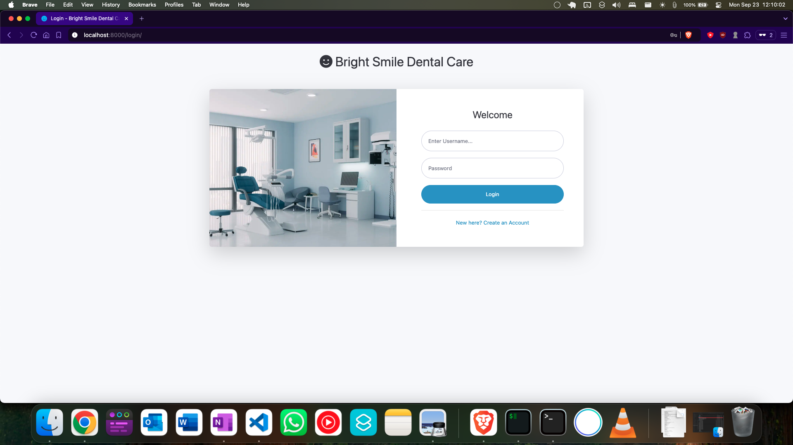

#### REGISTER USER

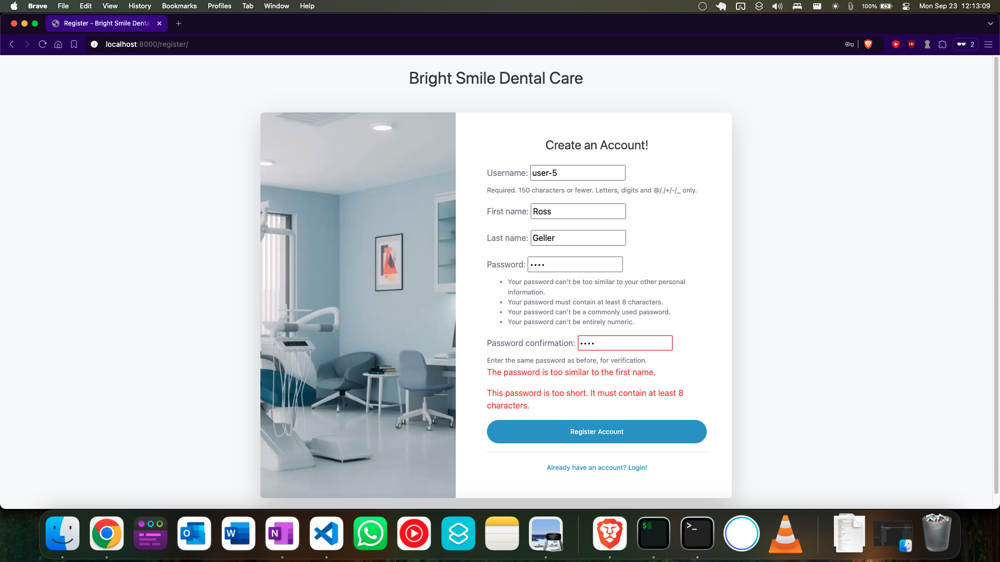

#### CLINICS PAGE

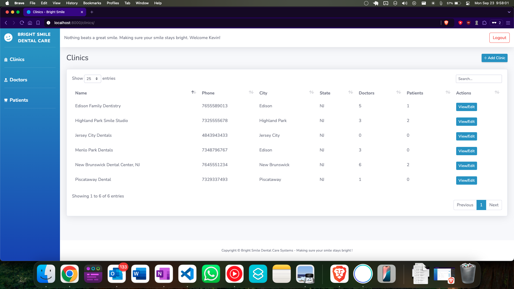

#### CLINICS DETAILS PAGE

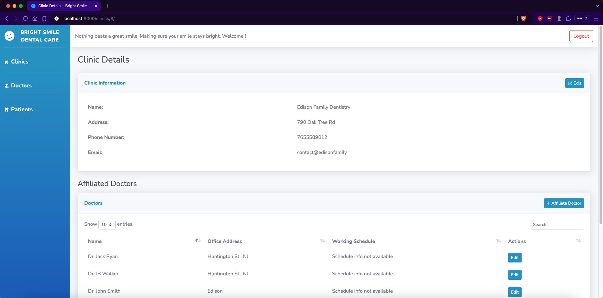

#### DOCTORS LIST PAGE

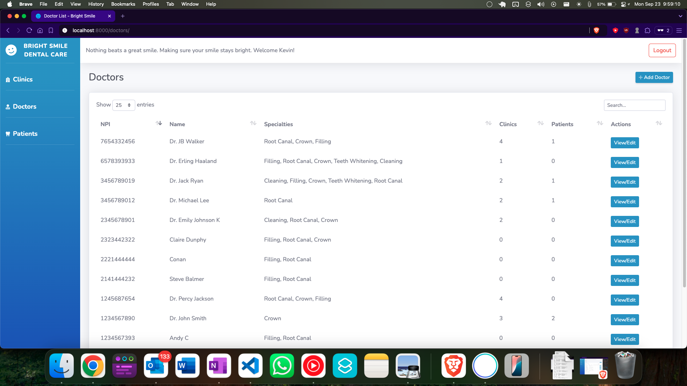

#### DOCTORS DETAILS PAGE

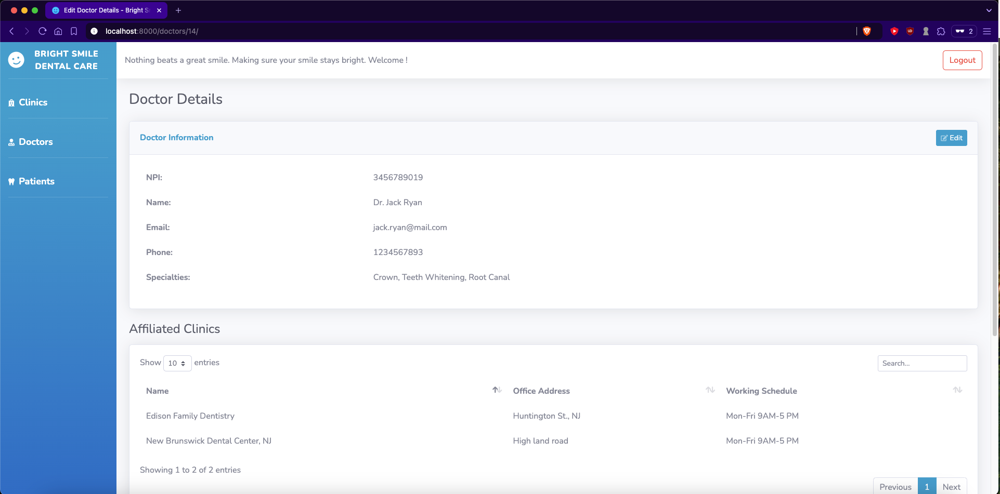

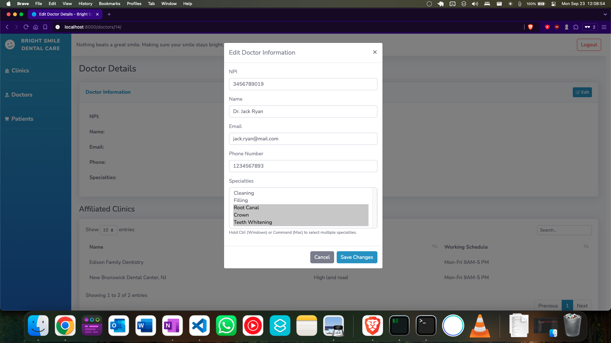

#### PATIENT LIST PAGE

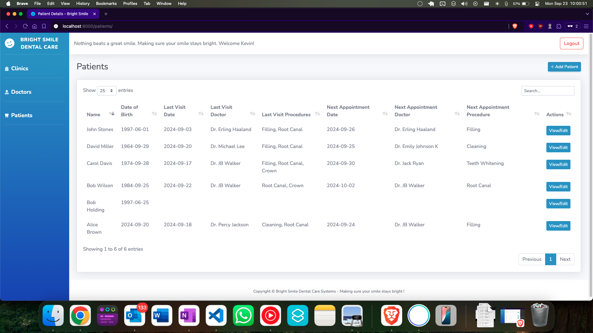

#### PATIENT DETAILS PAGE

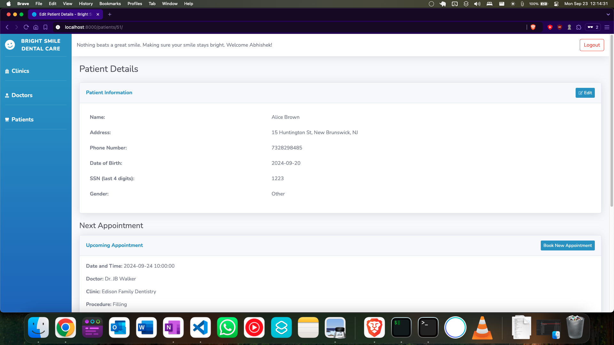

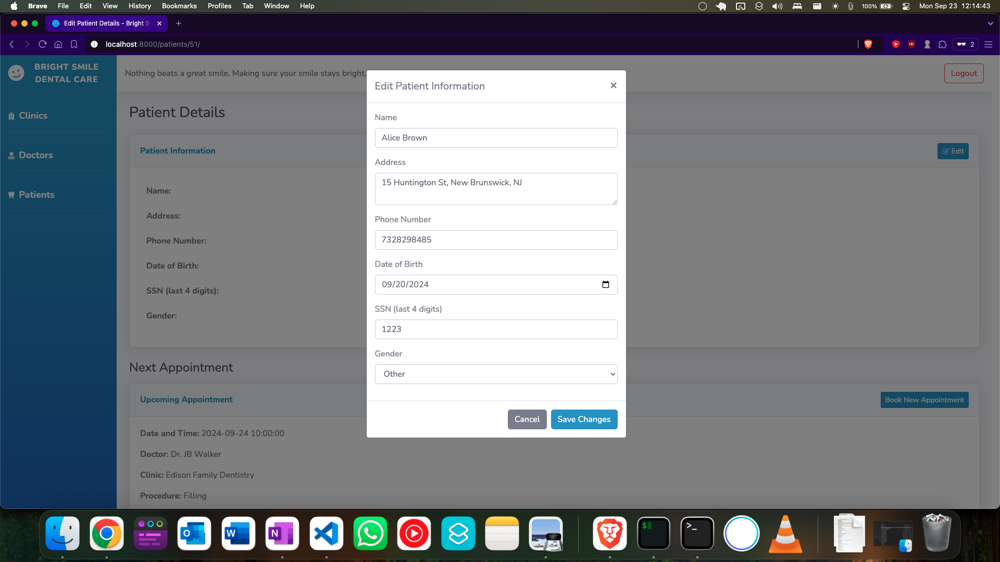

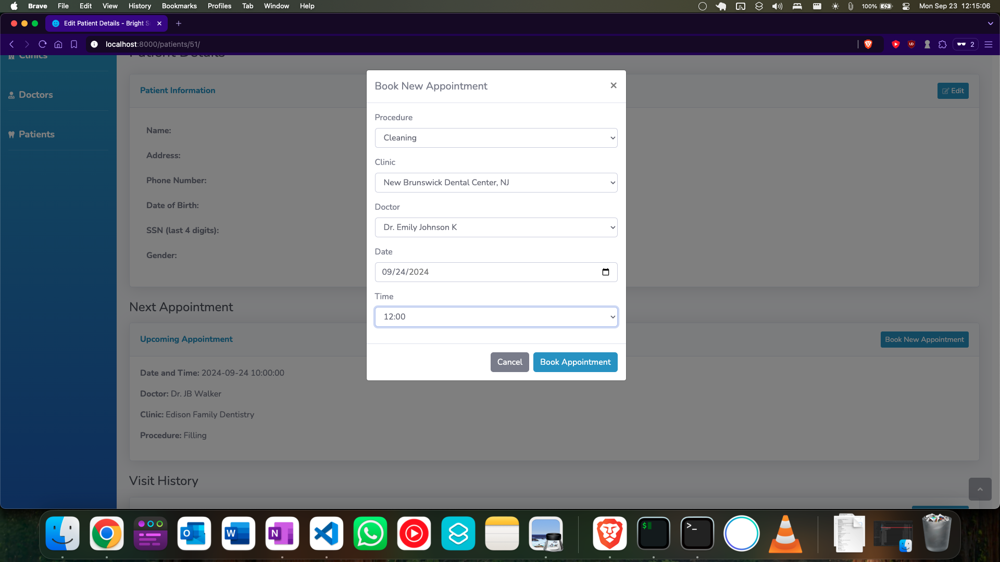

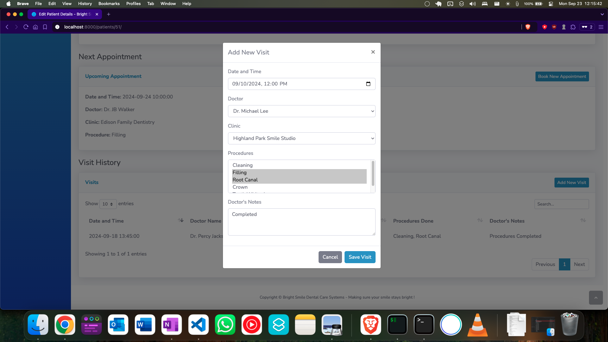

## Future Improvements

* Implement a more granular time control for appointments
* Add support for multiple languages
* Integrate a calendar view for appointment management
* Implement real-time notifications for new appointments
* Add dark mode

## License

This project is licensed under the MIT License.
